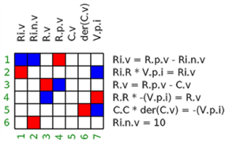

# Tutorial

This chapter contains a short tutorial about the data structures and
functions provided by package [ModiaBase](https://github.com/ModiaSim/ModiaBase.jl).


## 1. Regular DAEs (Index Zero DAEs)

In this subsection functions are demonstrated that can be used to
transform regular DAEs to ODEs.

The transformations are explained with the
following simple electrical circuit (a low pass filter where the
voltage source is modelled with an inner resistor):


### 1.1 Bi-Partite Graph

In a first step, the structural information of the low pass filter model is provided as incidence matrix


- Every **column** corresponds to one time-varying **variable**.
  Parameters, so variables with constant values, are not shown.

- Every **row** corresponds to one **equation**.

- A cell is marked (here in *blue*), if a time-varying variable is
  present in one equation. Variables that are appearing differentiated,
  such as `C.v`, are not marked because in a first analysis phase, these potential
  state variables are treated as known.

The matrix above is called the **incidence matrix** or the
**bi-partite graph** of the circuit. In ModiaBase, this matrix is represented
as vector `G` of Integer vectors:

```julia
# Bi-partite graph of low pass filter
G = [ [25,27],  # equation 1 depends on variables 25,27
      [6,23],
      [4,10],
      ...,
      [27] ]
```

This can be also made more explicit (and a bit more efficient storage)
by defining the incidence matrix as:

```julia
# Bi-partite graph of low pass filter
G = Vector{Int}[ [25,27],  # equation 1 depends on variables 25,27
                 [6,23],
                 [4,10],
                 ...,
                 [27] ]
```

### 1.2 Linear Integer Equations

Object-oriented models consist of a lot of linear Integer equations, especially due to the connect-statements.
The linear integer equations of `G` are identified and the corresponding linear factors
are determined. With function [`simplifyLinearIntegerEquations!`](@ref) this information is used to simplify
the equations by transforming the linear Integer equations with a fraction-free (exact) Gaussian elimination to
a special normalized form and then perform the following simplifications:

- Equations of the form `v = 0` are removed and `v` is replaced by „0“ at all places where
  `v` occurs, and these equations are simplified.

- Equations of the form `v1 = v2` and `v1 = -v2` are removed, `v1`  is replaced by `v2` (or `-v2`)
  at all places where `v1` occurs (so called *alias-variables*), and these equations are simplified.

- *Redundant equations* are removed.

- Variables that appear *only* in the linear Integer equations (and in no other equations) are set to zero, if
  they can be *arbitrarily selected*. For example, if an electrical circuit is not
  grounded, then one of the electrical potentials is arbitrarily set to zero.

- State constraints are made structurally visible.

After applying [`simplifyLinearIntegerEquations!`](@ref) to the low pass filter circuit,
the incidence matrix is simplified to


```julia
# Bi-partite graph of simplified low pass filter
G = Vector{Int}[ [1,2,4],
                 [1,7],
                 [3,4],
                 [3,7],
                 [6,7],
                 [2] ]

# Eliminated variables
R.i        = -(V.p.i)
ground.p.v = 0
R.p.i      = -(V.p.i)
R.n.v      = C.v
V.n.i      = -(V.p.i)
V.n.v      = 0
V.p.v      = Ri.n.v
Ri.p.i     = V.p.i
C.n.v      = 0
C.p.v      = C.v
Ri.p.v     = R.p.v
C.n.i      = V.p.i
V.i        = V.p.i
R.n.i      = V.p.i
C.p.i      = -(V.p.i)
ground.p.i = 0
C.i        = -(V.p.i)
Ri.i       = V.p.i
V.v        = Ri.n.v
Ri.n.i     = -(V.p.i)
```


### 1.3 Assignment

In a follow-up step, an assignment is made (also called matching), to associate
one variable uniquely with one equation:



- *Red* marks show the assigned variables.
- *Blue* marks show if a variable is part of the respective equation

The assignment is computed with function [`ModiaBase.matching`](@ref)
returning a vector `assign`:

```julia
using ModiaBase
vActive    = fill(true,7)
vActive[5] = false    # state C.v is known
assign     = matching(G, 7, vActive)

# assign = [2,6,3,1,0,5,4]
```

The meaning of vector `assign` is that

- Variable 1 is solved from equation 2,
- Variable 2 is solved from equation 6,
- etc.


### 1.4 Sorting

In a follow-up step, equations are sorted and algebraic loops determined
(= Block Lower Triangular transformation):


- *Red* marks show the assigned variables.
- *Blue* marks show if a variable is part of the respective equation
- A *grey* area marks an algebraic loop.

The sorting is computed with function [`ModiaBase.BLT`](@ref):

```julia
using ModiaBase
blt = BLT(G, assign)

#=
    blt = [ [6],
            [3,4,2,1],
            [5] ]
=#
```

The meaning is for example that the second BLT block consists of
equations 3,4,2,1 and these equations form an algebraic loop.


### 1.5 Reducing sizes of equation systems

In a follow-up step, the sizes of equation systems are reduced by
variable substitution (= tearing). Applying [`ModiaBase.tearEquations!`](@ref) to the 
low pass filter circuit, reduces the dimension of BLT block 2 from size 4 to size 1
resulting in the following equation system:

```julia
# iteration variables (inputs): C.i
# residual variables (outputs): residual

R.v := R.R*C.i
R.i.v := -Ri.R*C.i
R.p.v := Ri.v + V.v
residual := R.v - R.p.v + C.v
```


### 1.6 Generation of AST

In a final step, the AST (Abstract Syntax Tree) of the model is
generated. Hereby, it is determined that the equation system of section 1.4 and 1.5
is linear in the iteration variable (`C.i`) and an AST is generated
to build-up a linear equation system `A*C.i = b` and solve this system numerically
with an LU decomposition whenever the AST is called (if the equation system has size 1, 
a simple division is used instead of calling a linear equation solver). Applying
[`ModiaBase.getSortedAndSolvedAST`](@ref) results basically in a function
`getDerivatives` that can be solved with the many ODE integrators of
[DifferentialEquations.jl](https://github.com/SciML/DifferentialEquations.jl):

```julia
function getDerivatives(_der_x, _x, _m, _time)::Nothing
    _m.time = ModiaLang.getValue(_time)
    _m.nGetDerivatives += 1
    instantiatedModel = _m
    _p = _m.evaluatedParameters
    _leq_mode = nothing
    time = _time
    var"C.v" = _x[1]
    var"V.v" = (_p[:V])[:V]
    begin
        local var"C.i", var"R.v", var"Ri.v", var"R.p.v"
        _leq_mode = _m.linearEquations[1]
        _leq_mode.mode = -2
        while ModiaBase.LinearEquationsIteration(_leq_mode, _m.isInitial, _m.time, _m.timer)
            var"C.i" = _leq_mode.vTear_value[1]
            var"R.v" = (_p[:R])[:R] * var"C.i"
            var"Ri.v" = (_p[:Ri])[:R] * -var"C.i"
            var"R.p.v" = var"Ri.v" + var"V.v"
            _leq_mode.residual_value[1] = (var"R.v" + -1var"R.p.v") + var"C.v"
        end
        _leq_mode = nothing
    end
    var"der(C.v)" = var"C.i" / (_p[:C])[:C]
    _der_x[1] = var"der(C.v)"
    if _m.storeResult
        ModiaLang.addToResult!(_m, _der_x, time, var"R.v", var"R.p.v", var"Ri.v", var"C.i", var"V.v")
    end
    return nothing
end
```


## 2. Singular DAEs (Higher Index DAEs)

xxx
